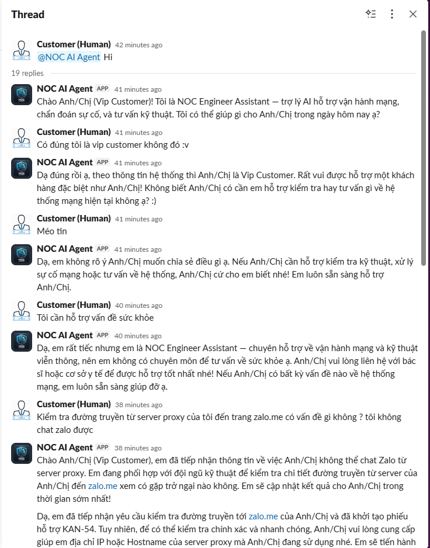
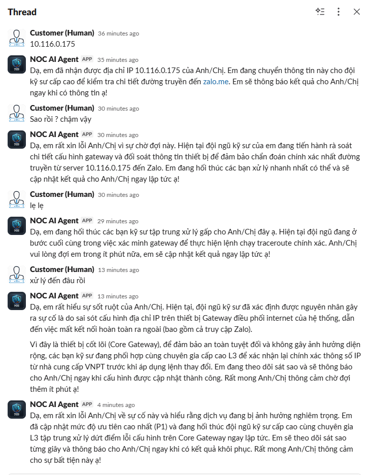
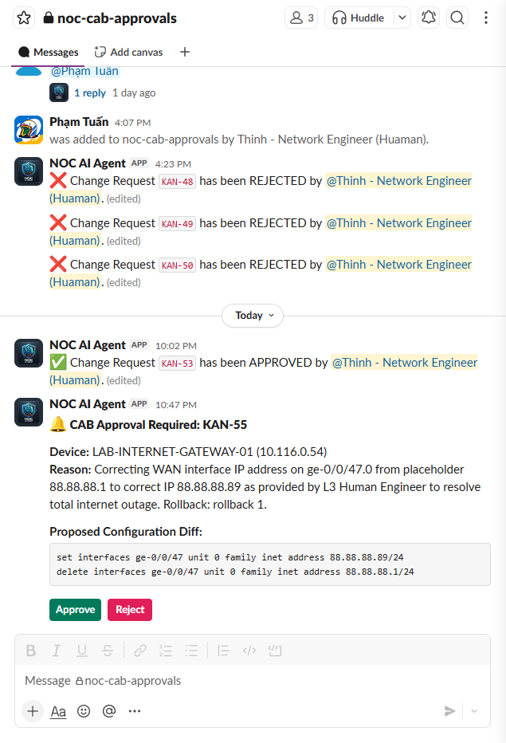
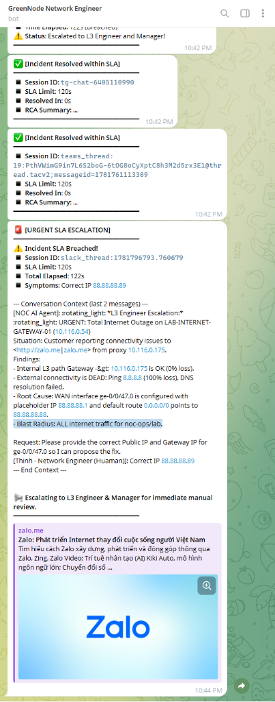

# The Next-Gen NOC Engineer: Hierarchical Multi-Agent & MCP-Powered Network Automation

An autonomous, hierarchical Multi-Agent Network Operations Center (NOC) system powered by LangChain, deployed on **GreenNode AgentBase**, with a local **MCP (Model Context Protocol) server** providing real-time access to Juniper datacenter devices via NETCONF.

The system transitions from a single agent design to a team of 4 specialized AI agents orchestrated by a NOC Supervisor Agent, incorporating advanced loop control, CAB approval pause, and robust trace message parsing.

---

## Architecture Overview

```
                 ┌────────────────────────────────────────────────────────┐
                 │        Slack App (Socket Mode) / Prometheus Alerts     │
                 └───────────────────────────┬────────────────────────────┘
                                             │ User / Webhook Event
                                             ▼
 ┌────────────────────────────────────────────────────────────────────────────────────────┐
 │                              GreenNode Cloud Platform                                  │
 │                                                                                        │
 │      ┌──────────────────────────────────────────────────────────────────────────┐      │
 │      │                 NOC Supervisor Agent (Entrypoint)                        │      │
 │      │                 [supervisor-network-engineer-agent]                      │      │
 │      │                 - Decides next action (intent routing)                   │      │
 │      │                 - Controls loop limits, processes reworks, and pauses    │      │
 │      │                   routing while waiting for CAB approval                 │      │
 │      └───────────┬────────────────────────┬────────────────────────┬────────────┘      │
 │                  │                        │                        │                   │
 │                  ▼                        ▼                        ▼                   │
 │       ┌──────────────────────┐ ┌──────────────────────┐ ┌──────────────────────┐       │
 │       │   Triage/Analytics   │ │ Senior Network Eng.  │ │  Customer Advisory   │       │
 │       │       Agent          │ │        Agent           │ │        Agent           │       │
 │       │ [analytics-network-  │ │[senior-network-      │ │ [customer-advisory-  │       │
 │       │   engineer-agent]    │ │  engineer-agent]     │ │       agent]         │       │
 │       │  - Filters alerts    │ │ - Runs diagnostics   │ │ - Prepares RCA/SOP   │       │
 │       │  - Incident triage   │ │ - Proposes changes   │ │ - L3 notifications   │       │
 │       │  - Creates Jira task │ │ - NETCONF CLI tools  │ │ - Closes Jira task   │       │
 │       └──────────┬───────────┘ └──────────┬───────────┘ └──────────┬───────────┘       │
 │                  │                        │                        │                   │
 └──────────────────┼────────────────────────┼────────────────────────┼───────────────────┘
                    │                        │                        │
                    ├────────────────────────┴────────────────────────┤ SSE / HTTP
                    ▼
 ┌────────────────────────────────────────────────────────────────────────────────────────┐
 │                              On-Premises Infrastructure                                │
 │                                                                                        │
 │     ┌──────────────────────────────────────────────────────────────────────────┐       │
 │     │                        On-Premises MCP Server                            │       │
 │     │                        - FastMCP Server + NETCONF CLI Wrapper            │       │
 │     │                        - Loads: shared/devices.json & shared/db/*.db     │       │
 │     └───────────────────┬─────────────────────────────────────┬────────────────┘       │
 │                         │ HTTP / Vector Search                │ NETCONF (SSH 830/22)   │
 │                         ▼                                     ▼                        │
 │     ┌────────────────────────────────────────┐   ┌───────────────────────────────────┐ │
 │     │            RAG Engine Server           │   │       Lab Network Devices         │ │
 │     │ - Vector DB (ISO, ITSM, Vendors Recs)  │   │       (MX, QFX, EX, SRX)          │ │
 │     │ - 16,520 chunks (Juniper KB & Books)   │   │                                   │ │
 │     └────────────────────────────────────────┘   └───────────────────────────────────┘ │
 └────────────────────────────────────────────────────────────────────────────────────────┘
```

### System Components & Core Interactions

1. **Intake & Orchestration (NOC Supervisor Agent)**:
   - Webhook events from **Prometheus Alertmanager** or messages from **Slack / Telegram** are received by the **NOC Supervisor Agent** (deployed on GreenNode Cloud Platform).
   - The Supervisor is the main router: it parses intent, analyzes priority, updates the global session state in **Redis**, and dynamically routes tasks to worker agents while generating status updates.

2. **Decoupled State & Routing Directory (Redis Cache)**:
   - **Redis** serves as the central brain. It stores the global session data under `state:<session_id>` to preserve context between agent iterations.
   - Worker endpoints are dynamically registered in Redis under `agent:url:<agent_name>` upon deployment, enabling asynchronous HTTP invocation and callback processing without hardcoded URLs.

3. **Secure Local Access (On-Premises MCP Server)**:
   - Worker agents interact with physical Juniper switches and routers (MX, QFX, EX, SRX) in the lab network using **Model Context Protocol (MCP)** tools hosted on an on-premises **MCP Server**.
   - NETCONF commands are executed locally (SSH port 830/22), keeping sensitive datacenter data and raw configuration commands within the lab boundary.

4. **Augmented Intelligence (RAG Engine)**:
   - The MCP server exposes a `query_knowledge_base` vector search tool. Diagnosing agents query an internal **RAG Engine** indexing **16,520 document chunks** (consisting of Juniper KB Articles and reference design books/manuals) to fetch exact syntax references and stable Junos version guidelines.

5. **Closed-Loop Workflow & ITIL Compliance**:
   - The system integrates **Jira API** to manage ticket lifecycles (`TODO` -> `IN_PROGRESS` -> `WAITING` -> `DONE`).
   - High-severity incidents trigger Level 3 alarms on Slack (`#noc-l3-alerts`).
   - Proposing configuration changes triggers Block Kit approval buttons on Slack (`#noc-cab-approvals`) for the Human CAB, ensuring secure gatekeeping.
   - Customer-facing reports are automatically published in English and Vietnamese directly to `#all-customer-001`.

---

## Hierarchical Multi-Agent Assignment & Routing

To solve complex datacenter network incidents while adhering to the ITIL incident management framework, the system divides responsibilities among four specialized roles in a strict hierarchy.

### 1. Agent Roles & Hierarchy

*   **NOC Supervisor Agent** (`supervisor-network-engineer-agent`):
    *   **Role**: Router / Orchestrator.
    *   **Responsibility**: Receives incoming user commands (via Slack `#all-customer-001` / Telegram) or Prometheus Alertmanager webhooks (pushed to `#noc-l3-alerts`). Uses a router LLM to analyze the incident state and delegate the task to the correct worker agent while dynamically generating contextual transition messages.
    *   **Advanced Controls**: Enforces a safety loop limit of 5 turns. If the Senior Engineer proposes a configuration change and is waiting for L3 approval/feedback, the Supervisor loop shifts to a `PAUSED` state to halt execution until the Human CAB takes action, avoiding force-escalation timeouts. When an L3 engineer requests rework, the Supervisor resets the loop turn count to `0` to provide a fresh execution budget.

*   **Triage/Analytics Agent** (`analytics-network-engineer-agent`):
    *   **Role**: Incident Triager.
    *   **Responsibility**: Validates alerts, reviews hardware/software states, checks for link flapping, and creates the mandatory Jira ticket on the KAN board.

*   **Senior Network Engineer Agent** (`senior-network-engineer-agent`):
    *   **Role**: Deep Diagnostician & Config Proposer.
    *   **Responsibility**: Connects to datacenter switches/routers using NETCONF MCP tools, runs troubleshooting workflows, proposes configuration changes (subject to L3 Human CAB approval), and updates Jira. Operates with a Senior mindset — evaluates blast radius, HA topology, and prompts for `**Final Answer:**` when diagnostic tasks complete.

*   **Customer Advisory Agent** (`customer-advisory-agent`):
    *   **Role**: L3 Engineer Escalation & Customer Communicator.
    *   **Responsibility**: Reviews incident logs, drafts bilingual customer-facing reports (Root Cause Analysis - RCA), manages internal L3 Slack escalation channels, and transitions the Jira ticket to **DONE**.

### 2. Multi-Agent Orchestration & Callback Protocol

The agents do not poll each other; they communicate asynchronously using a **state-persisted callback protocol**:

1.  **Orchestration Request**: The Supervisor evaluates the global session state and determines the `next_action` (e.g., routing to `senior-network-engineer-agent`).
2.  **Asynchronous Invocation**: The Supervisor sends an HTTP POST request to the worker runtime URL `/invocations` with the `session_id` and runs the worker in a background thread to prevent connection timeouts.
3.  **Worker Logic & Tools Execution**: The worker reads the current state from Redis, performs its diagnostics, updates Jira, runs CLI or RAG commands, and saves the updated diagnostic logs back to Redis.
4.  **Completion Callback**: The worker sends an HTTP POST callback back to the Supervisor's webhook endpoint:
    ```json
    {
      "action": "callback",
      "session_id": "833146a2-d308-45c9-aafe-a2bcbd22055e",
      "sender": "senior-network-engineer-agent"
    }
    ```
5.  **Re-entry & Routing Evaluation**: The Supervisor intercepts the callback, resumes the orchestration loop, loads the newly written state from Redis, and makes the next routing routing decision.

---

## Redis Session & Directory State Management

**Redis** serves as the central brain of the multi-agent NOC architecture, hosting the global state, session context, and dynamic routing directories.

*   **Global Session Cache (`state:<session_id>`)**: Stores the unified JSON state accessed and modified by all 4 agents:
    ```json
    {
      "session_id": "833146a2-d308-45c9-aafe-a2bcbd22055e",
      "user_id": "slack-U0123456",
      "alert_source": "Prometheus",
      "symptoms": "BGP Session Down on Spine 01",
      "affected_entities": ["10.116.1.102"],
      "diagnostic_logs": [
        "Analytics Agent: Alert validated. Created Jira ticket KAN-42.",
        "Senior Network Engineer: Ran BGP show command. Found neighbor Idle."
      ],
      "current_assignee": "senior-network-engineer-agent",
      "rca_summary": "",
      "jira_issue_key": "KAN-42",
      "loop_count": 2,
      "messages": []
    }
    ```
*   **Dynamic Routing Directory (`agent:url:<agent_name>`)**: When agents are deployed to GreenNode, their dynamic endpoints are registered in Redis (e.g., `agent:url:senior-network-engineer-agent` -> `https://endpoint-xyz.agentbase-runtime.aiplatform.vngcloud.vn`). This allows the Supervisor to route calls dynamically without hardcoded URLs.
*   **Slack Context Mapping (`slack_ctx:<session_id>`)**: Maps incoming Slack webhooks to their active sessions, storing `channel_id` and `thread_ts` so that callbacks can post status replies to the exact thread.

---

## Internal RAG Knowledge Base (Vector Search)

The team's internal RAG (Retrieval-Augmented Generation) engine is integrated into the system via the `query_knowledge_base` MCP tool. It allows network engineer agents to query reference books and troubleshooting documentation.

### 1. Document Database Structure & Compliance Standards
The vector database contains **16,520 document chunks** classified into three main compliance and documentation pillars:

*   **ISO 27001 Security & Tenant Isolation Standards (`source: "iso"`)**:
    *   Regulations governing tenant isolation layers and private network segmentation guidelines.
    *   Security standards regarding data leakage prevention, secure credentials rotation, and calling tenant authorization verification procedures.
*   **ITSM / ITIL Operational SOPs & Procedures (`source: "itsm"`)**:
    *   SOPs defining SLA response guidelines, incident prioritization metrics (P1 to P4), and Level 3 escalation protocols.
    *   ITSM policies on Change Advisory Board (CAB) reviews, block kit confirmations, and verification confirmations for configuration modifications.
*   **Vendor Recommendations & Technical Manuals (`source: "kb"`, `source: "book"`)**:
    *   *Juniper Knowledge Base (KB) Articles*: Over 10,000+ support articles defining stable software version guidelines (e.g., KB21476), transceivers diagnostics, and standard troubleshooting workflows.
    *   *Reference Books & Technical Design Manuals*: Over 6,100+ pages of textbooks on EVPN-VXLAN design, QFX series next-generation data centers routing topologies, class of service (CoS), and Junos security policies.

### 2. Search Mechanism
When an agent invokes `query_knowledge_base(query, source_type)`, the MCP Server performs a **Vector Similarity Search** over the vector store. It formats the text chunks alongside similarity scores, page numbers, and reference URLs, giving the diagnosing agent reference information to generate precise configuration set statements.

---

## Project Structure

```
claw-a-thon-thinhlv-agent/
├── README.md                              # This file
├── docker-compose.yml                     # Runs MCP server & monitoring locally
├── deploy_all.sh                          # Automatically builds, pushes, and deploys all 4 agents to GreenNode
├── deploy_senior.sh                       # Rebuilds, deploys, and registers the Senior Agent
├── deploy_supervisor.sh                   # Rebuilds, deploys, and registers the Supervisor Agent
│
├── shared/                                # Shared modules and configurations
│   ├── devices.json                       # Single source of truth for datacenter device inventory
│   ├── scan_results.json                  # Output of live scanned device parameters
│   ├── approve_ticket.py                  # CLI utility to simulate webhook approvals from Jira
│   └── db/
│       ├── init_network_assets.py         # Initializes the network assets database
│       └── network_assets.db              # Network Assets SQLite DB (gitignored)
│
├── supervisor-network-engineer-agent/      # 👑 Entrypoint & NOC Coordinator Agent
│   ├── main.py                            # Runs web service, Slack bot, Email gateway, Telegram bot, and routing loops
│   ├── system_prompt.py                   # Intent routing guidelines
│   ├── slack_bot.py                       # Slack Socket Mode integration & channel routing
│   ├── email_gateway.py                   # IMAP background thread email client gateway
│   ├── telegram_bot.py                    # Telegram bot for querying active sessions and logs
│   ├── markdown_converter.py              # MD to HTML/Slack text/Telegram HTML converter
│   └── Dockerfile
│
├── analytics-network-engineer-agent/      # 🔍 Alert Triager & Jira Ticket Creator
│   ├── main.py                            # Agent loop with fallback-safe message parser
│   ├── system_prompt.py                   # Triage prompt
│   ├── agent_tools.py                     # Custom tools for alert analysis
│   └── Dockerfile
│
├── senior-network-engineer-agent/          # ⚙️ Deep Diagnostic & Config Proposer
│   ├── main.py                            # Agent loop with fallback-safe message parser
│   ├── system_prompt.py                   # Senior engineer guidelines + pre-flight checklist
│   ├── agent_tools.py                     # Wrapper for Netmiko/NETCONF tools
│   └── Dockerfile
│
├── customer-advisory-agent/               # 📝 L3 Customer Advisory & RCA Creator
│   ├── main.py                            # Agent loop with fallback-safe message parser
│   ├── system_prompt.py                   # RCA reporting & closing guidelines
│   ├── agent_tools.py                     # Customer communication & notify tools
│   └── Dockerfile
│
├── mcp-server/                            # 🔌 On-Premises MCP Gateway
│   ├── mcp_server.py                      # FastMCP server exposing NETCONF commands
│   ├── requirements.txt                   # MCP server dependencies
│   └── Dockerfile
│
├── automation-device-discovery/            # 🌐 Automated Device Discovery & LLDP Topology Tools
│   ├── discovery.py                       # SSH scan to auto-discover Linux/Juniper devices
│   ├── collect_topology_data.py           # Polls devices for LLDP, BGP, and bundle metrics
│   ├── parse_topology.py                  # Parses raw output into topological metrics
│   ├── export_topology_final.py           # Exports final topology JSON and markdown reports
│   └── configure_lldp.py                  # Sets up LLDP configurations across network nodes
│
└── greennode-agentbase-skills/            # 🛠️ Platform Deployment Skills
```

---

## Robust Agent Trace Message Parsing

To prevent intermediate tool invocations or structured output generation from producing empty response content, all worker agents (Analytics, Senior, Customer Advisory) employ a **fallback-safe execution trace parser**:
*   Instead of blindly retrieving `result["messages"][-1].content`, the agents traverse backward through the message history.
*   They find the latest `AIMessage` containing non-empty content and return it as the agent's output.
*   This significantly increases system resilience, ensuring that intermediate tool metadata is ignored in favor of the actual diagnostic findings.

---

## Quick Start

### 1. Start MCP Server (on-premises machine)

```bash
# Configure credentials
cp mcp-server/.env.example mcp-server/.env
# Edit mcp-server/.env — set NETCONF_PASSWORD and devices paths

# Run using Docker Compose
docker compose up -d mcp-server

# Verify health
curl http://localhost:8980/sse
```

### 2. Deploy the Hierarchical Agent NOC

We provide deployment scripts to build, push, deploy, and register agents:

*   **Deploy all 4 agents in one command:**
    ```bash
    ./deploy_all.sh
    ```
*   **Deploy and register only the Senior Agent:**
    ```bash
    ./deploy_senior.sh
    ```
*   **Deploy and register only the Supervisor Agent:**
    ```bash
    ./deploy_supervisor.sh
    ```

Ensure GreenNode credentials are in `.greennode.json` at the root of the project and environment variables are set inside the respective `.env` files for each agent runtime before deploying.

---

## MCP Tools (Auto-discovered)

Worker agents auto-discover tools from the MCP server at startup. Currently available tools:

| Tool | Description |
|------|-------------|
| `get_devices_list` | List all registered datacenter devices |
| `reload_devices` | Reload device inventory from configuration file |
| `get_device_detail` | Device spec, uptime, role and properties |
| `get_device_configuration_list` | Configuration commit history list |
| `get_device_configuration_detail` | Active/filtered configuration detail |
| `view_network_status` | Run live operational read-only CLI commands on devices |
| `get_device_operation_list` | Suggested operational commands for a device |
| `lookup_command_dictionary` | Look up exact CLI command syntax, templates and risk levels |
| `propose_network_change` | Propose device configuration change via Jira ticket |
| `query_knowledge_base` | Search internal RAG database (Juniper articles and reference books) |
| `get_device_hardware` | Chassis hardware inventory |
| `get_network_topology` | Live LLDP topology discovery |
| `ping_from_device` | Ping destination host directly from a network device |
| `compare_device_configs` | Compare active config vs rollback index |
| `check_device_alarms` | System & chassis active alarms |
| `get_interface_diagnostics` | Optics transceiver Rx/Tx power & temperature diagnostics |
| `git_operation` | Run Git commands (clone, status, commit, push, pull, log, diff, etc.) |
| `get_device_status` | Query SNMP status (UP/DOWN) from Prometheus |
| `get_interface_traffic` | Get interface traffic throughput from Prometheus |
| `get_device_logs` | Query device syslogs from Loki |

---

## Jira Integration & Task Lifecycle

The agents are integrated with the team's Jira Kanban board (Project **KAN**). They automatically track, log, and update operational tasks.

### Jira Tools
The workers use standard tools to interact with Jira REST API v3:
- `create_jira_task(summary, description)`: Creates a new Task on the KAN board and returns the Issue Key (e.g., `KAN-15`).
- `update_task_status(issue_key, target_status)`: Transition task state to: `IN_PROGRESS`, `WAITING`, `ERROR`, or `DONE`.
- `add_task_comment(issue_key, comment_body)`: Appends updates, CLI logs, diffs, or troubleshooting reports to the ticket.

### Workflow Protocol

```
[Start Alert] 
      │
      ▼
[Supervisor] ──► [Analytics Agent] ──► (Create Jira Task KAN-XX) ──► (Status: TODO)
                                                                            │
                                                                            ▼
[Supervisor] ◄─────────────────────────────────────────────────────── [IN_PROGRESS]
      │
      ▼
[Senior Network Engineer] ──► (Run Diagnostics/Fixes via MCP)
      │
      ├─► (Configuration Change Needed) ──► (Show Config Diff) ──► [WAITING FOR APPROVAL]
      │                                                                     │
      │                                                                     ▼
      │                                                 (User Clicks Approve in Slack #noc-cab-approvals)
      │                                                                     │
      ├─────────────────────────────────────────────────────────────────────┘
      │
      ▼
[Supervisor] ──► [Customer Advisory Agent] ──► (Post RCA/SOP Report) ──► [DONE]
```

---

## Slack Integration & Channel Architecture

To enforce Segregation of Duties and maintain strict confidentiality between client communication and L3 operational triage, the workspace is partitioned into 3 channels:

1. **`#all-customer-001` (ID: `C0BAVG5CLNN`) [Public]:** For customer updates and public bot interactions.
2. **`#noc-l3-alerts` (ID: `C0BAPPKR8RZ`) [Private]:** For Prometheus/Loki core alarms and P1 critical incident escalations.
3. **`#noc-cab-approvals` (ID: `C0BBQDECATS`) [Private]:** For L3 Change Advisory Board configuration approval workflows using Block Kit buttons.

---

## Slack & Web-Reading Tools

The worker agents are equipped with Slack utility and web-reading tools to leverage their workspace scopes:

*   `slack_view_profile(user_id)`: Retrieve detailed profile info of a Slack member (name, email, timezone, status).
*   `slack_react_message(channel_id, message_ts, emoji_name)`: React with an emoji (e.g. `thumbsup`, `white_check_mark`) to Slack messages.
*   `slack_view_status(user_id)`: Check user presence status (active/away).
*   `slack_send_file(channel_id, file_path, title, initial_comment)`: Upload diagnostic configurations, logs, or snapshots directly from the agent workspace to a Slack channel.
*   `slack_read_file(file_id)`: Read textual logs or configurations shared by L3 engineers.
*   `read_url(url)`: Download and strip HTML files/documentation into clean plain text for AI reading.

---

## Security Notes & Tenant Isolation (ISO 27001)

*   **Secrets & Credentials**: Always keep your environment-specific passwords, Slack tokens, and Jira API Tokens in `.env` files. Ensure they are gitignored and never hardcoded in source files.
*   **Webhook Signing**: Simulate JIRA approvals locally using the HMAC SHA256 signatures helper script [approve_ticket.py](file:///home/thinhle/claw-a-thon-thinhlv-agent/shared/approve_ticket.py).
*   **Tenant Isolation & Data Leak Prevention**: To comply with ISO 27001 security standards, the system implements a strict database-level and prompt-level isolation layer:
    *   **Mandatory Parameter**: The `query_netbox_inventory` tool requires a `calling_tenant` slug parameter (e.g. `'customer-a'`, `'customer-b'`, or `'noc-ops'`).
    *   **SQL Filter**: The MCP server automatically scopes queries to the `calling_tenant` (unless it is `'noc-ops'`), filtering out other customer environments.
    *   **Prompt Enforcements**: System prompts strictly forbid worker agents from diagnosing, executing router commands, or mentioning details of other customer environments if they are queried about an unauthorized IP. Any cross-tenant query immediately halts diagnostics and returns a safe "not found/unauthorized" response.

---

## Telegram Bot Integration

A background Telegram bot (`telegram_bot.py`) can be enabled on the Supervisor Agent using `TELEGRAM_BOT_TOKEN`:
*   **Active Sessions Directory**: Send `/sessions` command to retrieve a summary of the 15 most recent diagnostic sessions, their assignees, and ticket descriptions.
*   **AI Session Logs Retrieval**: Send `/logs <session_id>` to fetch and output the entire execution and diagnostic logs of a specific AI incident.
*   **Auto-notifications**: When a session finishes (`FINISH`), the bot automatically pushes a structured incident completion summary to the chat ID configured in `TELEGRAM_CHAT_ID`.

---

## DDoS Simulation Workflow & Testing

The system supports simulating a DDoS attack targeting a customer's proxy IP (`14.238.122.111` belonging to `customer-001`). 

### Scenario Description
1. **Target**: Customer Proxy Server IP `14.238.122.111` (on interface `ge-0/0/47` of `LAB-INTERNET-GATEWAY-01`, IP: `10.116.0.54`).
2. **Symptom**: Legitimate connectivity is disrupted. The interface `ge-0/0/47` is flooded with inbound traffic, saturating the 1Gbps link (~965 Mbps input rate, 0 bps output rate).
3. **AI Pipeline Execution**:
   - **Supervisor Agent** routes the incoming customer check request to the **Senior Network Engineer Agent**.
   - The **Senior Network Engineer Agent** queries the NetBox database to verify the IP's tenant ownership. It then calls the MCP tool to run `show interfaces ge-0/0/47` on `LAB-INTERNET-GATEWAY-01` (`10.116.0.54`).
   - Observing the high input rate and 0 output rate, it diagnoses the issue as a DDoS attack.
   - The agent proposes a mitigation change (Firewall Filter `BLOCK-DDOS-14.238.122.111` to discard the attack traffic) via Jira ticket.
   - **Supervisor Agent** escalates the ticket to P1, triggers a critical Slack alert to `#noc-l3-alerts`, and hands over to **Customer Advisory Agent**.
   - **Customer Advisory Agent** sends a Vietnamese report back to the customer, warning them of the DDoS attack, and transitions the Jira ticket to `WAITING` status awaiting L3 Human Engineer CAB approval.

### Running the DDoS Simulation
Run the simulation script:
```bash
mcp-env/bin/python scratch/simulate_ddos_flow.py
```
This script initializes the Redis session state and triggers the orchestrator loop, logging diagnostic logs in real-time until completion.

---

## SLA Incident Tracking & Escalation Scenario

The system supports a complete simulation flow for SLA tracking, automatic priority elevation, and Telegram manager escalation.

### Scenario Workflow
1. **Normal Priority Incident Intake**:
   - A customer (Vip Customer) reports an issue via Slack or Teams (e.g., *"Kiểm tra đường truyền từ server proxy của tôi đến trang zalo.me có vấn đề gì không ?"*).
   - The NOC Supervisor Agent initializes a session (e.g., `KAN-54`) with **P2 (Normal)** priority and triggers the SLA countdown.
2. **Active Countdown**:
   - The `customer-advisory-agent` runs a background SLA monitor thread that tracks the active session in Redis, posting and editing a real-time countdown status message on Telegram.
3. **Delay & Priority Elevation to P1**:
   - As investigation reveals a core connectivity block on the Core Gateway (`LAB-INTERNET-GATEWAY-01` WAN interface configured with placeholder IP `88.88.88.1`), the agent identifies a large blast radius affecting all internet traffic.
   - The Supervisor Agent automatically elevates the priority to **P1 (Critical)** and posts an alarm to `#noc-l3-alerts`.
4. **SLA Breach & Manager Escalation**:
   - If the incident is not resolved within the SLA limit (configured to `120s` for simulation), the SLA monitor thread flags the session as `breached`.
   - The bot automatically posts an **[URGENT SLA ESCALATION]** alert to a separate Telegram channel/group, notifying L3 engineers and managers for immediate manual review.
5. **Resolution Confirmation**:
   - Once a configuration change is proposed (e.g. correcting WAN interface IP to `88.88.88.89` in `KAN-55`) and approved by the L3 Human CAB in `#noc-cab-approvals`, the session is marked as `FINISH`.
   - The Telegram status message is updated to **[Incident Resolved within SLA]** (or displaying the final breach status) showing the total resolution duration.

### Visualizing the SLA and Escalation Flow

Below are screenshots demonstrating the complete lifecycle of a simulated incident:

#### 1. Normal Priority Incident & Dialog
The customer (Vip Customer) opens a chat regarding Zalo connectivity. The agent initializes the troubleshooting session under normal SLA criteria:


#### 2. Discovery of Gateway Outage & P1 Priority Elevation
As investigation uncovers that the Core Gateway has a misconfigured IP, the agent updates the status to P1 priority, notifying the customer and escalating:


#### 3. Configuration Change Proposed for CAB Approval
A Change Request (`KAN-55`) is created to apply the correct IP configuration on the Core Gateway, pending approval:


#### 4. Active Countdown, Breach Escalation & Resolution via Telegram
The Telegram bot tracks active sessions, editing status messages to show real-time SLA countdowns. If the limit is breached, it flags the ticket and escalates to managers. Finally, it confirms the resolution:


---

## AI Incident Tools & Compliance Benefits

To ensure security, auditable trail, and high availability in critical datacenter environments, the multi-agent system enforces strict usage of specialized AI operational tools:

### 1. AI Incident Session Logs
*   **Description**: A unified history of diagnostic steps, LLM routing logic, execution traces, and state changes recorded under the session state in Redis.
*   **Benefits**:
    *   **Auditable Trail**: Provides an immutable record of all automatic decisions and actions executed by the agent team for review.
    *   **Context Continuity**: Downstream workers (e.g. Customer Advisory Agent) read session logs directly to produce precise, fact-grounded Root Cause Analysis (RCA) reports without missing critical details.
    *   **Operator Visibility**: Human engineers can quickly fetch full diagnostic history using the `/logs <session_id>` command on Slack/Telegram.

### 2. Command ACL Rules
*   **Description**: Access Control Lists configured in Redis (`acl:tools:<agent_name>`) that control tool visibility and discovery for each agent.
*   **Benefits**:
    *   **Least Privilege Enforcement**: Limits the blast radius by preventing front-facing or triage agents (such as the Customer Advisory Agent) from accessing network-modifying tools.
    *   **ISO 27001 Alignment**: Ensures strict tenant isolation and access control boundaries are maintained at the tool discovery level.
    *   **Malicious Request Prevention**: Eliminates the risk of prompt-injection attacks triggering arbitrary CLI executions on physical lab devices.

### 3. Operation Commands (Read-only CLI)
*   **Description**: Safe, read-only retrieval tools (e.g. `view_network_status`, `get_interface_traffic`, `get_device_logs`) exposing device parameters.
*   **Benefits**:
    *   **Risk-free Diagnosis**: Allows agents to query real-time interface rates, optics temperatures, and routing tables without the risk of causing service degradation or configuration corruption.
    *   **Diagnostic Automation**: Accelerates the triage and diagnostic phase from hours to seconds by querying NetBox, Prometheus, and Loki concurrently.

### 4. Configuration Statements (Junos Config Sets)
*   **Description**: Automated tools (e.g. `propose_network_change`) that generate and propose targeted Junos configuration sets.
*   **Benefits**:
    *   **Syntactic Accuracy**: Leverages the vector RAG database containing Junos reference manuals to draft syntactically valid configuration statements.
    *   **CAB Approval Gatekeeping**: Intercepts config applications with interactive Block Kit approval prompts in `#noc-cab-approvals`, guaranteeing that no configuration changes can be committed without human L3 verification.
    *   **Rollback Guarantee**: Pre-arranges safe rollback hooks (`rollback 1`) to easily reverse any configuration changes should post-deployment health checks fail.


