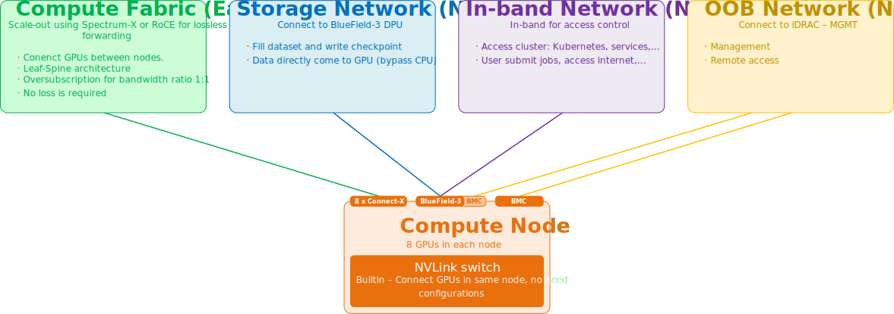
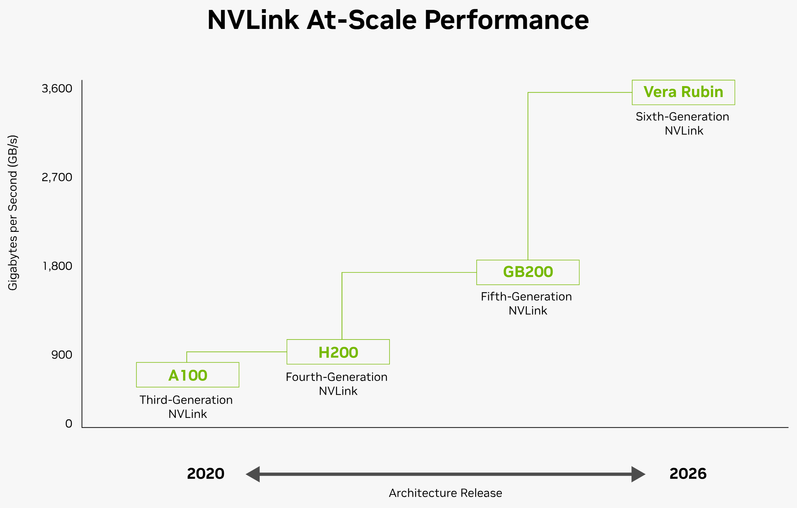
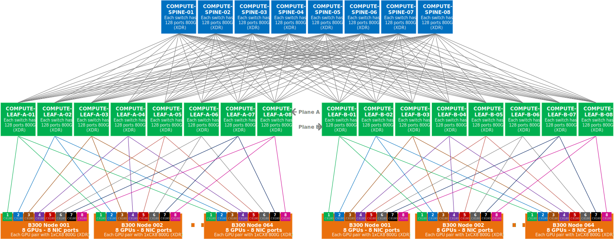
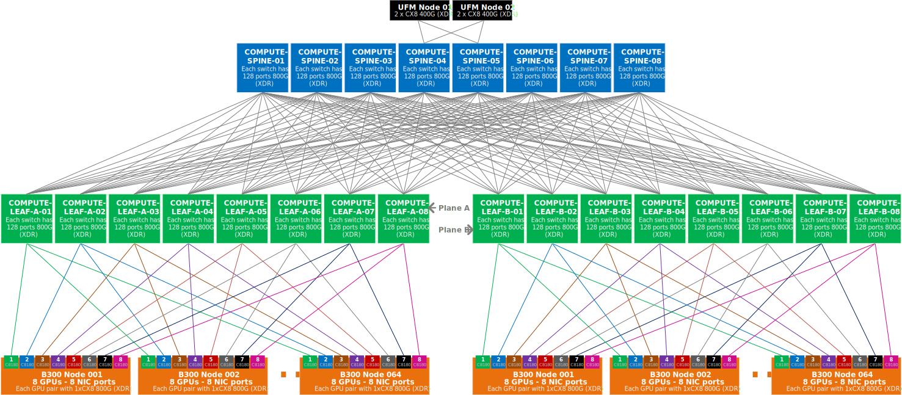
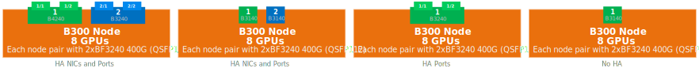
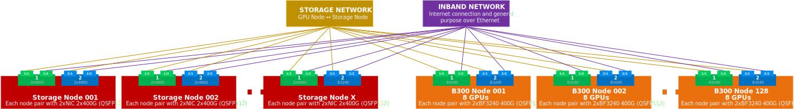
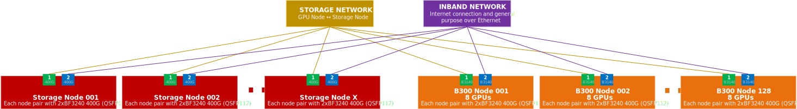

# AI Cluster Network

> * Bài viết này không đi sâu vào từng chi tiết kỹ thuật về thuật toán, công nghệ. Mục đích chính của nó là giúp người đọc hiểu tổng quát các thành phần mạng của AI Network, mà trung tâm là các GPU Node, từ đó có thể xây dựng mạng AI Network hoàn chỉnh ở mức hạ tầng (AI Infrastructure). Do đó, nó sử dụng nhiều từ ngữ mang tính khái quát hoá. Bạn có thể tham khảo các tài liệu chuyên sâu sau đó để nắm rõ tuỳ theo nhu cầu tìm hiểu.
> * Phạm vi của bài viết tập trung chủ yếu vào kiến trúc hạ tầng của NVIDIA ở các phần xây dựng và qui hoạch chi tiết. Nên không thể lấy đó áp dụng cho các Vendor khác một cách dập khuôn, cần tìm hiểu cẩn thận những đặc thù của mỗi Vendor.

---

# Giới thiệu chung về AI Network

## Mục đích đáp ứng của AI Network

* Kết nối giữa các GPU node với nhau để thực hiện việc training.
* Kết nối giữa các GPU với hệ thống Storage để nạp dữ liệu training và ghi các record.
* Kết nối GPU, Storage với các hệ thống điều khiển, phân chia tenant, và với Internet.
* Kết nối toàn bộ các thiết bị với hệ thống quản trị Out-of-band.
* Kết nối với các hệ thống Server quản lý/automation cho các thiết bị network (nếu có).

## Khái niệm

**AI network** là hạ tầng mạng chuyên dụng dùng để kết nối các bộ tăng tốc (GPU/accelerator) trong một cụm, phục vụ huấn luyện và suy luận các mô hình AI quy mô lớn.

Điểm khác biệt cốt lõi so với mạng truyền thống nằm ở đặc tính lưu lượng: tải AI phân tán đòi hỏi các GPU thường xuyên đồng bộ với nhau (các phép collective như all-reduce), tạo ra lưu lượng **East/West** đồng bộ, và nếu một GPU chậm thì cả cụm phải chờ. Vì vậy, AI network được thiết kế để tối ưu cho **độ trễ thấp, đều đặn và tính không-mất-gói (lossless)** hơn là chỉ thông lượng thô - ngược với mạng Internet/ISP vốn theo mô hình best-effort.

Về tổng quát, một AI network không phải một mạng duy nhất mà là tập hợp nhiều **mặt phẳng tách biệt**, mỗi mặt phẳng cho một loại lưu lượng:

* **Scale-up** (trong node): nối các GPU trong cùng máy chủ thành một khối, băng thông cực lớn, độ trễ gần bằng truy cập bộ nhớ — ví dụ NVLink/NVSwitch.
* **Scale-out / Compute (East/West)**: nối GPU giữa các node để chạy huấn luyện phân tán, thường dùng InfiniBand hoặc Ethernet tối ưu cho AI (RDMA/RoCE, lossless), topology Spine-Leaf kiểu fat-tree.
* **North/South**: lưu lượng ra ngoài cụm — truy cập storage (nạp dữ liệu, ghi checkpoint), điều phối/quản lý, người dùng và Internet.

Nói gọn: AI network là **mạng kết nối GPU được tối ưu cho giao tiếp tập thể tốc độ cao, độ trễ thấp và lossless**, để toàn cụm hoạt động như một cỗ máy tính toán thống nhất thay vì nhiều máy rời rạc.

## AI Network vs Enterprise/ISP/DC network

Traffic của các Network còn lại chủ yếu là North-South, nhiều luồng độc lập. Một số DC Network cũng được xây dựng dựa trên mô hình East-West sử dụng kiến trúc Spine-Leaf, nhưng vẫn được sử dụng trong môi trường truyền dẫn nhiều flows.

Cụ thể, lưu lượng truyền trong các Enterprise/ISP/DC network:

* Số lượng flows rất lớn, do đó các thuật toán cân bằng tải dựa trên Ethernet/IP/TCP/UDP hoạt động tốt, lưu lượng phân phối tương đối đồng đều trên các link ECMP.
* Không quá nhạy cảm về mặt thời gian như độ trễ (delay) hay mất gói (loss), TCP có thể hỗ trợ truyền lại (retransmit) và không gây nhiều ảnh hưởng đến dịch vụ.

Trong cụm training AI thì ngược lại hoàn toàn.

Khi train một model lớn, model được chia ra trên hàng trăm/nghìn GPU. Sau mỗi bước tính toán, tất cả GPU phải **đồng bộ kết quả với nhau** (gọi là **all-reduce** — cộng gradient rồi phát lại cho mọi GPU). Điều này tạo ra ba đặc tính khác biệt:

* Số lượng flows ít hơn hẳn so với các Network thông thường (chỉ có các GPU làm việc với nhau), nhưng lượng dữ liệu truyền tải trong mỗi flow là rất lớn. Mạng Ethernet/IP thông thường sẽ không tối ưu về cân bằng tải lưu lượng (traffic load balancing) đối với số lượng ít flow (chỉ load sharing dựa trên một số field), có thể lưu lượng training sẽ dồn về hết 1 link nếu chỉ dùng 1 flow.
* Traffic chủ yếu là East-West (GPU↔GPU), đồng loạt, mọi GPU truyền cùng lúc.
* GPU nhanh nhất cũng sẽ chạy bằng GPU chậm nhất. Mất gói hay tắc nghẽn ở một phân đoạn truyền/xử lý lưu lượng sẽ kéo tụt hiệu suất cả nghìn GPU.
* Vì vậy mạng phải **lossless** (không rớt gói do tắc nghẽn) và **độ trễ rất thấp, đều đặn** - không phải theo hướng "best effort".

Đó là lý do khi thiết kế AI Network, người ta tách hẳn nhiều mặt phẳng mạng riêng, thay vì dồn hết vào một fabric.

## Infiniband và Ethernet

### Infiniband

# GPU Node

## HGX hay DGX

| Criteria | NVIDIA HGX | NVIDIA DGX |
|----------|------------|------------|
| **Bản chất** | Một baseboard / nền tảng tham chiếu - khối xây dựng để OEM lắp server quanh nó | Một hệ thống hoàn chỉnh, turnkey - server đóng gói sẵn, cắm điện là chạy |
| **Ai thiết kế & lắp ráp** | OEM/đối tác (Dell, HPE, Lenovo, Supermicro…) dựng chassis quanh baseboard của NVIDIA | NVIDIA thiết kế, dựng và hỗ trợ trực tiếp |
| **GPU & interconnect** | 8 × GPU SXM nối bằng NVLink/NVSwitch | 8 × GPU SXM nối bằng NVLink/NVSwitch (về cơ bản giống nhau - HGX chính là baseboard nằm bên trong DGX) |
| **Mức tùy biến** | Cao: OEM/khách tự chọn CPU, RAM, storage, networking, tản nhiệt, chassis, PSU | Thấp: cấu hình cố định (fixed BOM) do NVIDIA quy định |
| **Networking** | Do OEM/khách quyết - ví dụ cụm B300 dùng ConnectX-8 + Spectrum-X Ethernet, BlueField-3,… | NVIDIA chọn sẵn, thường nghiêng về InfiniBand - ví dụ DGX H100 dùng module InfiniBand 1.6 Tbps với Card ConnectX-7 |
| **Phần mềm** | Tùy OEM; thường để khách tự dựng stack | Tích hợp sẵn full stack AI của NVIDIA (driver, CUDA, công cụ vận hành) |
| **Hỗ trợ & bảo hành** | Qua OEM, nhiều biến thể tùy hãng | Một đầu mối duy nhất: NVIDIA |
| **Thời gian triển khai** | Lâu hơn - phải tích hợp, kiểm thử | Nhanh nhất - giảm tối đa độ phức tạp tích hợp, rút ngắn time-to-productivity |
| **Tính linh hoạt mở rộng** | Linh hoạt theo nhu cầu (chọn topology, mật độ, tản nhiệt theo dự án) | Đi theo kiến trúc chuẩn của NVIDIA (ví dụ DGX SuperPOD cho quy mô lớn) |
| **Đối tượng phù hợp** | Tổ chức muốn kiểm soát, tùy biến, tối ưu chi phí/cấu hình; nhà cung cấp dịch vụ, hyperscaler | Tổ chức muốn giải pháp chuẩn, đồng nhất, ít rủi ro tích hợp, có hỗ trợ chính hãng |
| **Ví dụ thế hệ Blackwell** | HGX B200, HGX B300 (vd. server Dell PowerEdge XE9780) | DGX B200, DGX B300, DGX SuperPOD, và DGX Station GB300 |
| **Mô hình chi phí** | Linh hoạt - trả theo cấu hình tự chọn, thường tối ưu hơn nếu biết rõ nhu cầu | Trọn gói, giá cao hơn nhưng đổi lấy sự tiện lợi và bảo chứng từ NVIDIA |

:::tip
**Tips**

HGX là "bo mạch nền" để OEM tự dựng server theo ý mình; DGX là nguyên chiếc server hoàn chỉnh do NVIDIA làm sẵn — cùng một "trái tim" GPU + NVLink, khác nhau ở chỗ ai ráp phần còn lại và ai chịu trách nhiệm hỗ trợ.

:::

## Network Interface Card

Trên một GPU node, các NIC không cùng một loại - NIC được chia theo các Network planes mà nó phục vụ. Có ba loại chính (không tính port OOB):

1. **ConnectX SuperNIC** — NIC tốc độ cao nhất, sử dụng cho Network East/West (GPU↔GPU giữa các node, tải training). Thông thường, nó được gắn theo tỉ lệ 1:1 với GPU. 1 node có bao nhiêu GPU, sẽ có bấy nhiêu NIC ConnectX.
2. **BlueField SuperNIC** — cũng được dùng cho Network East/West nhưng dựa trên kiến trúc BlueField, là lựa chọn "nhẹ" hơn ConnectX SuperNIC trong một số thiết kế.
3. **BlueField DPU** — NIC sử dụng trong Network North/South (storage, quản lý, bảo mật). DPU là viết tắt của Data Processing Unit, thực chất là một bộ xử lý chuyên dụng ngay trên NIC, như một máy tính riêng của mỗi NIC, đảm nhiệm vai trò quản lý, tăng tốc các tác vụ mạng và bảo mật.

   BlueField DPU là một hệ thống trên chip (SoC) tích hợp các thành phần mạnh mẽ bao gồm:
   * **Bộ xử lý ARM:** Các nhân ARM đa nhiệm cho phép lập trình linh hoạt để chạy hệ điều hành và các ứng dụng mạng.
   * **NIC ConnectX:** Tương tự như ConnectX đã đề cập ở trên.
   * **Công cụ tăng tốc phần cứng:** Các vi mạch dành riêng cho việc mã hóa/giải mã, nén dữ liệu và bảo mật.

   :microphone: Nói một cách khác, BlueField DPU NIC giống như một ConnectX NIC được gắn thêm bộ xử lý riêng, nhằm giảm workload liên quan đến các tác vụ mạng cho GPU Node. Nó offload một số tác vụ xuống bộ xử lý riêng của NIC.

   Vì BlueField DPU được thiết kế và hoạt động như một máy tính riêng, nên nó cũng có OOB port độc lập với GPU Node. Trong phạm vi tài liệu này, sử dụng thuật nữa BF.BCM để đề cập (BlueField BCM)
4. **OOB Port:** Dùng cho mục đích quản trị, phổ biến trên tất cả các server, nó là một NIC tích hợp. Đối với các GPU node, nó được gọi là cổng BCM.

Phân biệt giữa SuperNIC và DPU: SuperNIC tối ưu cho việc chuyển bit GPU↔GPU nhanh, còn DPU là một máy tính thu nhỏ có nhân Arm riêng, chạy hệ điều hành riêng để gánh hộ CPU các việc hạ tầng.

:::tip
**Tips**

ConnectX và BlueField đều hỗ trợ Infiniband và Ethernet. Mặc định tự detect network Infiniband hoặc Ethernet khi cắm vào.

:::

###  ConnectX SuperNIC

Đây là NIC được dùng trong Compute Fabric (Network plane kết nối GPU <→ GPU). Nó hỗ trợ cả InfiniBand lẫn Ethernet ở tốc độ tới 800 Gb/s.

* **Tốc độ & giao thức**: 800 Gbps InfiniBand XDR hoặc 2×400G Ethernet (Spectrum-X), hỗ trợ tới 8 cổng. 
* **PCIe Gen6 + switch tích hợp**: ConnectX-8 tích hợp sẵn PCIe Gen6 và một PCIe switching fabric trên chính nó, loại bỏ nhu cầu chip PCIe switch ngoài. Cung cấp tới 48 lanes PCIe cho các mục đích như chuyển mạch PCIe bên trong hệ thống GPU.
* **In-network computing**: hỗ trợ SHARP (Scalable Hierarchical Aggregation and Reduction Protocol) để tăng tốc các phép aggregation/reduction trong cụm AI/HPC lớn, cùng telemetry-based routing và kiểm soát tắc nghẽn, giúp giảm đáng kể tail latency và ổn định cụm GPU quy mô lớn. 

Đánh số phiên bản: `ConnectX-<generation number>`. Ví dụ: ConnectX-7, ConnectX-8, ConnectX-9.

:::tip
**Tips**

Mỗi GPU thường đi kèm với một NIC ConnectX. Nếu một GPU Node có 8 GPUs, nó sẽ có 8 NIC ConnectX.

:::

**Các model ConnectX**

Cùng một thế hệ ConnectX có thể có models khác nhau, phụ thuộc vào thiết kế phần cứng dành cho tốc độ tối đa hoặc mục đích sử dụng. Chúng thường được đánh mã là một chuối số theo nguyên tắc sau:

`<nic type><generation number><number of ports><first 2 digits of maximum bandwidth supported>`

Ví dụ, xét model NIC C8180:

* **C:** ConnectX (BlueField là B)
* **8:** Thế hệ thứ 8 (ConnectX-8)
* **1:** 1 Port trên NIC
* **80:** Bandwidth hỗ trợ tối đa 800Gbps cho 1 NIC

ConnectX-8 có model hỗ trợ 2 port 400Gbps, là C8240.

Đến thời điểm 2026, NVIDIA đã giới thiệu ConnectX-9.

| Criteria | ConnectX-8 SuperNIC | ConnectX-9 SuperNIC |
|----------|---------------------|---------------------|
| **Thế hệ nền tảng** | Blackwell (HGX B200/B300) | Rubin (Vera Rubin NVL72/NVL144, HGX Rubin NVL8) |
| **Tốc độ mỗi cổng** | Tới 800 Gb/s        | Tới 800 Gb/s per port |
| **Cấu hình Ethernet** | Thường 2×400G để đạt 800G | 1×800G trên một cổng đơn, không cần gộp nhiều link |
| **InfiniBand** | XDR (800G)          | XDR, tích hợp Quantum-X800 |
| **Băng thông tới GPU** | 800 Gb/s/GPU (1:1)  | tới 1.6 Tb/s throughput tới GPU Rubin(cặp NIC/GPU) |
| **PCIe** | Gen6 @ 64GT/s qua x16 edge connector, có PCIe switch tích hợp | Gen6 @ 64GT/s; hỗ trợ Socket Direct/Multi-Host |
| **In-network computing** | SHARP, telemetry routing, congestion control | programmable IO và intelligent congestion control, GPUDirect RDMA tối ưu sâu hơn |
| **Mức tích hợp** | Card rời gắn trên baseboard | Co-design sâu với nền tảng — có module I/O bốn-chiều ConnectX-9 cho hệ Vera Rubin NVL144 |
| **Thời điểm GA** | 2024–2025           | firmware GA tháng 2/2026 |

:::warning
**Warning**

Tốc độ 800 Gbps của CX8 chỉ áp dụng khi sử dụng Infiniband network. Đối với Ethernet network, hỗ trợ tốc độ tối đa 400 Gbps, nên models C8180 phải sử dụng transceiver Ethernet Twinports để tách thành 2 port 400 Gbps.

:::

### BlueField SuperNIC

Cùng nhiệm vụ East/West dựa trên kiến trúc BlueField. SuperNIC được tối ưu riêng cho tải AI: kích thước nhỏ hơn, công suất thấp hơn, tập trung vào truyền dữ liệu băng thông cao, độ trễ thấp giữa các GPU (ví dụ 400Gb/s RDMA over RoCE), lý tưởng cho điện toán AI siêu quy mô. Về cấu hình, model B3140H là một SuperNIC với 8 nhân Arm, 16GB DDR5 và một cổng 400Gb/s Ethernet hoặc NDR InfiniBand. Khác biệt cốt lõi so với DPU: SuperNIC cung cấp networking hiệu năng cao kiểu fixed-function, nhưng thiếu Compute Fabric lập trình được và bộ phần mềm phong phú như kiến trúc DPU.

Các model BlueField

Đánh số phiên bản: `BlueField-<generation number> <SuperNIC hoặc DPU>`

Naming: `<nic type><generation number><number of ports><first 2 digits of maximum bandwidth supported>`

Ví dụ, xét model NIC B3140:

* **B:** BlueField
* **3:** Thế hệ thứ 3 (BlueField-3)
* **1:** 1 Port trên NIC
* **40:** Bandwidth hỗ trợ tối đa 400Gbps cho 1 NIC

BlueField-3 có model hỗ trợ 2 port 200Gbps, là B3240.

Đến thời điểm 2026, NVIDIA đã giới thiệu BlueField-4. Ở BlueField-4 xuất hiện thêm một dòng mới, là BlueField-4 STX, là NIC chuyên hỗ trợ cho Storage.

:::tip
**Tips**

Thông thường mỗi thế hệ ConnectX ra đời sẽ kèm theo một thế hệ mới của BlueField. Vì bản chất BlueField tương tự như ConnectX kết hợp với các thành phần riêng khác trong cùng 1 NIC.

:::

### BlueField DPU (North-South, hạ tầng)

Là một nền tảng tính toán hạ tầng, xử lý ở tốc độ line-rate các tác vụ software-defined networking, storage và bảo mật, kết hợp năng lực tính toán mạnh, mạng tốc độ cao và khả năng lập trình rộng.

* **Nhân Arm + bộ nhớ riêng**: với tối đa 64 nhân Arm và 800Gb/s Ethernet/NDR InfiniBand (trên thế hệ BlueField-4 mới ra mắt),  giúp offload, tăng tốc và cô lập các chức năng networking, storage, bảo mật và quản lý.
* **Lập trình bằng DOCA**: DOCA cho phép ứng dụng chạy trực tiếp trên DPU, offload tác vụ khỏi CPU host, giảm latency và tăng hiệu quả đường dữ liệu - đây là điểm DPU vượt trội: nó có thể chạy firewall, micro-segmentation, zero-trust ngay trên card.
* **Các model**: Tương tự như BlueField SuperNIC

| Criteria | BlueField-3 DPU | BlueField-4 DPU | BlueField-4 STX |
|----------|-----------------|-----------------|-----------------|
| **Bản chất** | DPU đa dụng (đời Blackwell) | DPU đa dụng (đời Rubin) | Kiến trúc tham chiếu + processor BlueField-4 *chuyên storage* |
| **Băng thông** | 400 Gb/s        | 800 Gb/s (gấp đôi đời trước) | 800 Gb/s (dựa trên BF-4) |
| **Nhân Arm** | 16 nhân Cortex-A78 | 64 nhân Arm Neoverse V2 | BF-4 (64 nhân) tối ưu cho storage |
| **Transistor** | 22 tỷ           | 64 tỷ           | như BF-4        |
| **Bộ nhớ** | 32GB DDR5       | 128GB LPDDR5    | như BF-4        |
| **Cache** | 8MB             | 114MB L3 shared | như BF-4        |
| **SSD onboard** | nhỏ/không       | 512GB           | quản lý trực tiếp các NVMe SSD |
| **Compute so với đời trước** | mốc tham chiếu  | gấp 6 lần BF-3  | như BF-4        |
| **NIC tích hợp** | lConnectX-7     | ConnectX-9      |                 |
| **PCIe** | Gen5 x16        | Gen6            | Gen6            |
| **Vai trò** | North/South: SDN, storage, security | mạng front-end North/South: server↔storage, Internet cho inference, dịch vụ bảo mật | tầng lưu trữ tăng tốc chuyên dụng cho KV cache / agentic AI |
| **Cơ chế đặc trưng** | DOCA, BlueField SNAP | DOCA; "OS of AI factory" | định tuyến dữ liệu qua tầng storage tăng tốc bằng RDMA trên Spectrum-X, bỏ qua CPU host; xử lý toàn vẹn dữ liệu và mã hóa KV cache |
| **Hiệu năng tuyên bố** | —               | —               | 5x token throughput, 4x power efficency, 2x tốc độ nạp trang so với storage dựa trên CPU |
| **Triển khai đầu tiên** | —               | —               | Nền tảng CMX (Context Memory Storage), tầng bộ nhớ ngữ cảnh ở mức POD |
| **Công bố** | Blackwell era   | GTC Washington (10/2025) | GTC tháng 3/2026 |

### Bảng so sánh các loại NIC sử dụng cho cụm GPU B300

| Criteria | ConnectX-8 SuperNIC | BlueField-3 SuperNIC | BlueField-3 DPU |
|----------|---------------------|----------------------|-----------------|
| **Network planes** | **East/West (compute)** | **East/West (compute)** | **North/South (hạ tầng)** |
| **Mục đích chính** | GPU↔GPU tốc độ tối đa cho training | GPU↔GPU, biến thể tiết kiệm | Offload networking/storage/security khỏi CPU |
| **Tốc độ tối đa** | 800 Gb/s            | 400 Gb/s             | 400 Gb/s        |
| **Giao thức** | IB XDR 800G hoặc 2×400G Ethernet (Spectrum-X) | 400GbE / NDR IB (vài model 100G) | 400GbE / NDR IB (B3240); 200G/NDR200 (B3220) |
| **PCIe** | Gen6, có PCIe switch tích hợp, tới 48 lane | Gen5 x16             | Gen5 x16 (+tùy chọn mở rộng x16) |
| **Nhân Arm** | Không (network ASIC) | 8 nhân Arm           | 16 nhân Arm     |
| **Bộ nhớ onboard** | Không               | 16GB DDR5            | 32GB DDR5       |
| **Lập trình (DOCA)** | API tương thích, không chạy OS riêng | Hạn chế (fixed-function) | Đầy đủ — chạy OS Linux riêng trên DPU |
| **In-network computing** | Có (SHARP, telemetry routing, congestion control) | Cơ bản               | Có, thiên về SDN/storage/security |
| **BMC tích hợp** | Không               | Có                   | Có              |
| **Công suất / kích thước** | Cao nhất            | Nhỏ, tiết kiệm điện  | Lớn nhất (có thể >75W, cần nguồn PCIe phụ) |
| **Vai trò bảo mật** | QoS, mã hóa IPSec/MACSec ở mức NIC | Cơ bản               | Zero-trust, firewall, micro-segmentation |
| **Vị trí điển hình trên node** | 8 con/baseboard (1:1 với GPU) | 1–8 tùy thiết kế     | 1 con/server    |
| **Thế hệ kế tiếp (Rubin)** | ConnectX-9 SuperNIC | -                    | BlueField-4 DPU |

### Các thế hệ mới

Tại CES/GTC 2026 NVIDIA đã công bố nền tảng **Vera Rubin**, trong đó phần networking gồm bốn con silicon mới: NVLink 6 Switch, ConnectX-9 SuperNIC, BlueField-4 DPU và Spectrum-6 Ethernet Switch. Bảy con chip mới đã vào full production, và NVIDIA dự kiến nâng lên sản xuất số lượng lớn các hệ Vera Rubin NVL72 trong nửa cuối 2026. Nói cách khác, cặp ConnectX-8/BlueField-3 hiện tại sẽ được kế tục bởi ConnectX-9/BlueField-4 - cùng mô hình phân vai SuperNIC (East/West) và DPU (North/South), chỉ tăng tốc độ và năng lực.

# Các mặt phẳng (plane) của AI Network

:::tip
**Tips**

Các Network planes của AI Network có thể xem là các thành phần của một Network lớn, mỗi thành phần lại được thiết kế riêng dựa trên các mục đích kết nối tiêu chuẩn của một hay nhiều cụm GPU cluster. Có thể hiểu mỗi mặt phẳng là một Network nhỏ.

:::

:::info
**Notice**

Thiết kế network cho AI factory không giống với thiết kết network thông thường. Ở các network thông thường, bạn cân nhắc kiến trúc dựa trên nhiều yêu cầu về dịch vụ, đường truyền, kỹ thuật áp dụng (VPN, Routing, NAT, ACL, Firewall,…), kết hợp với việc qui hoạch nhiều thiết bị khác nhau vào mạng. Với AI network, bạn cần đặt trung tâm điểm của thiết kế vào các GPU Nodes. Mọi xây dựng đều hướng đến các GPU Nodes, Storage Nodes, đảm bảo bandwidth và xây dựng đầy đủ các Network planes.

:::

 

Một GPU Node (GPU Server) thường bao gồm 4-8 GPUs trong 1 Node, và có nhiều Network Interface Card (NIC). Ở thời điểm hiện tại, tham chiếu các hế hệ từ H100 đến B300, server NVIDIA DGX tiêu chuẩn có:

* 8 GPU
* 8 ConnectX NIC
* 2 BlueField NIC (mỗi NIC có 1 port MGMT BMC riêng cho NIC đó)
* 1 Ethernet NIC thông thường (1 port MGMT MBC)

Mỗi GPU Node cần kết nối đầy đủ với **5 Network planes** theo hình trên, tương ứng với mỗi loại NIC để đáp ứng được các mục đích được để cập ở đầu bài biết.

* NVLink Network
* Compute Fabric Network
* Storage Network
* In-band Network
* Out-of-band Network

## NVLink Network

`RDMA`

Gồm một NVLink switch chuyên dụng được tích hợp ngay trên baseboard của cụm GPU, không cần cấu hình hay quản trị. NVLink giúp các GPUs trong cùng 1 node có thể giao tiếp với nhau mà không cần đưa dữ liệu ra ngoài Node. Tác dụng:

* Giảm lưu lượng và sự phụ thuộc các Network phía ngoài.
* Tăng độ tin cậy giữa các GPU trong cùng một node.
* Hoạt động độc lập khi không tham gia vào Cluster.

NVLink là một kết nối 2 hướng có tốc độc lập lên tới 3.6 Tbps ở thế hệ mới nhất (NVLink-6 cho Rubin Platform). NVLink switch đóng vai trò thực thể chuyển mạch giúp kết hợp các NVLink và xây dựng full kết nối giữa GPU <→ GPU trong cùng 1 node.

 

## Compute Fabric Network

`RDMA` `infiniband or ethernet` `spine and leaf design`

Trong một số thiết kế, các hãng còn sử dụng thuật ngữ **Backend Network** để đề cập đến plane này.

**Mục đích chính của Compute Network là giúp giao tiếp các GPUs của tất cả các Node.**

### Scalable Unit (SU)

Đây là khái niệm rất quan trong khi thiết kế hạ tầng Compute Fabric Network cho GPU. Được NVIDIA đưa ra nhằm tiêu chuẩn hoá việc kết nối và mở rộng các GPU Node trong các tài liệu về Reference Architect của họ.

Thay vì thiết kế cụm đầu cho mỗi lần mở rộng, NVIDIA định nghĩa một **khối lặp lại, đã được thực hiện sẵn** gồm một số lượng GPU node cố định kèm với các thành phần thiết bị mạng, quản lý và storage tương ứng. Khối này gọi là Scalable Unit (SU). Để mở rộng qui mô, chỉ cần nhân bản số lượng SUs tuỳ theo nhu cầu. Nhờ khái niệm SU, DGX SuperPOD rút thời gian triển khai AI factory từ hàng tháng xuống còn hàng tuần.

:::tip
**Tips**

SU có thể xem là một block hoàn thiện về kết nối các GPU node.

:::

#### **Các thành phần của một SU**

* **Compute nodes** - số lượng cố định (xem bảng dưới).
* **Leaf switch của compute fabric** - đủ để nối toàn bộ NIC của các node trong SU theo hướng rail-optimized.
* **Phần mạng management + storage** tương ứng cho khối đó.
* **Layout rack, sơ đồ dây dẫn và sơ đồ kết nối (wiring guide, port mapping), điện và làm mát** đã được định sẵn.

Reference architecture của mỗi thế hệ đều kèm chi tiết về thiết kế SU, topology InfiniBand/NVLink/Ethernet, đặc tả storage, sơ đồ rack và hướng dẫn đấu nối.

:::tip
**Tips**

Ở phạm vi network, 1 SU bao gồm các GPU nodes và các Leafs được tuân theo tiêu chuẩn kết nối nhất định. Đối với Storage, thực tế cho thấy toàn bộ một AI Network có thể sử dụng chung một Storage Network, không cần phải có Storage Network riêng cho từng SU.

:::

#### Số node trên mỗi SU theo từng thế hệ

Kích thước SU không cố định mà tùy thế hệ các GPU node, thiết bị network và loại hệ thống. Vì vậy, khi thiết kế hệ thống network cho GPU nodes, cần tham khảo kỹ các Reference Architect của NVIDIA cho loại GPU muốn triển khai.

| Thế hệ (DGX SuperPOD) | Node / SU | Ghi chú |
|-----------------------|-----------|---------|
| **DGX H100**          | 32 DGX H100/SU | RA chuẩn tới 4 SU (128 node); mở rộng tới 64+ SU, 2,000+ node |
| **DGX H200**          | 32 DGX H200/SU | NDR (400G) InfiniBand |
| **DGX GB200 (NVL72)** | 8 hệ DGX GB200 NVL72/SU | Là 8 rack NVL72; mở rộng tới hơn 128 rack / 9,216 GPU |
| **DGX B300**          | 64 DGX B300/SU | XDR (800G) InfiniBand; một biến thể RA dùng XDR ghi 72 DGX B300/SU |
| **DGX Rubin NVL8**    | 72 node/SU (576 node trên 8 SU) | Mở rộng vượt 72 SU, hơn 2000 node Rubin NVL8 |

### Các thế hệ tốc độ kết nối

Các thế hệ tốc độ kết nối của Infiniband (do InfiniBand Trade Association định nghĩa) - mỗi viết tắt là một mức tốc độ tín hiệu trên **mỗi lane**:

* **NDR = Next Data Rate** → 100 Gbps mỗi lane.
* **XDR = eXtreme Data Rate** → 200 Gbps mỗi lane.

Chúng không tượng trưng cho một "kỹ thuật" riêng lẻ, mà là **nhãn thế hệ tốc độ link của InfiniBand**, nằm trong một chuỗi đặt tên có quy luật:

SDR (Single) → DDR (Double) → QDR (Quad) → FDR (Fourteen) → EDR (Enhanced) → HDR (High) → **NDR (Next)** → **XDR (eXtreme)** → (kế tiếp sẽ là GDR).

Một port thường gộp **4 lane**. Vì vậy:

* **NDR** = 100G/lane × 4 = **400 Gbps/port** → đúng tốc độ BlueField-3 (B3240). Biến thể **NDR200** chỉ dùng 2 lane = 200 Gbps (B3220).
* **XDR** = 200G/lane × 4 = **800 Gbps/port** → đúng tốc độ ConnectX-8.

Về mặt kỹ thuật bên dưới, từ HDR trở đi NVIDIA dùng điều chế **PAM4** (4 mức biên độ, gửi 2 bit mỗi symbol) thay cho NRZ của các đời cũ - đó là cách nâng từ 50G → 100G → 200G mỗi lane. Đây cũng là lý do của nội dung "XDR 800Gb/s PAM4 200G/lane" trên datasheet của NIC ConnectX-8.

:::info
**Notice**

**NDR/XDR là của InfiniBand**, không phải Ethernet. Khi NIC chạy ở chế độ Ethernet thì người ta gọi theo GbE (Ví dụ: 400GbE - **E** tượng trưng cho Ethernet). Cùng phần cứng, hai "ngôn ngữ" tốc độ khác nhau. Cần lưu ý các đoạn mã, thông số và mô tả kỹ thuật, tốc độ trên mỗi transceiver để phân biệt. Vì transciver cho InfiniBand và Ethernet là 2 loại khác nhau, không thể dùng chung.

:::

### Topology

:::tip
**Tips**

Mô hình tham khảo dựa trên thiết kế của GPU B300 với tiêu chuẩn SU gồm 64 Nodes. Một biến thể khác có thiết kế 1 SU gồm 72 Nodes để tận dụng hết port capacity của dòng Switch Infiniband: Quantum Q3400.

:::

Một số điểm cần lưu ý:

* Topology là **rail-optimized leaf-spine** (fat-tree). Ở đây, bổ sung thêm khái niệm **Rail** so với mô hình Spine-Leaf truyền thống nhằm tăng tốc kết nối các GPUs: NIC số *i* của **mọi** node trong cùng SU được nối vào **cùng một leaf switch số *i*** (gọi là "rail"). Nhờ vậy, GPU-1…8 của mọi node trong SU nói chuyện với nhau chỉ qua đúng 1 hop leaf — tối ưu cho all-reduce. 8 NIC/node thì có 8 rail, được đánh số từ 1 đến 8 trong thiết kế hạ tầng để dễ quản trị và phân biệt.
* Không cho phép bottleneck về băng thông, ở cần đảm bảo downlink xuống các GPU Node và uplink lên Spine luôn có Oversubscription Ratio là 1:1.
* Có thể sử dụng công nghệ Infiniband hoặc Ethernet đã đề cập ở trên (Infiniband là độc quyền của Nvidia, các Vendor khác chỉ hỗ trợ Ethernet).

 

 

:::info
**Notice**

Số port kết nối của Switch phải dựa vào kiến trúc phần cứng port, khả năng split-out, transceiver hỗ trợ như thế nào, từ đó mới lựa chọn được switch phù hợp cho từng hạ tầng InfiniBand và Ethernet. Điều này đặc biệt quan trọng, phải xem xét kỹ vì tốc độc cổng của các Ethernet switches thường chỉ đạt ½ so với tốc độ cổng của các InfiniBand switches, và các NIC trên GPU nodes cũng phải được điều chỉnh để tương thích. Ví dụ:

* Switch InfiniBand Q3400 có 64 slot port 1.6 Tbps: Muốn kết nối với HGX B300 CX8 cần sử dụng Transceiver OSFP twinports để từ 1 slot 1.6 Tbps trên switch tách thành 2 port 800 Gbps, mỗi port kết nối xuống 1 port CX8 800 Gbps ở đầu GPU node.
* Switch Ethernet N5610 có 72 slot port 800 Gbps: Muốn kết nối với HGX B300 CX8 cần sử dụng Transceiver QSFP112 twinports để từ 1 slot 800 Gbps trên switch tách thành 2 port 400Gbs, từ 1 slot 800 Gbps của CX8 trên GPU cũng phải sử dụng QSFP112 twinports để tách thành 2 port 400 Gbps, rồi mới đấu nối với từng port trên switch.

:::

**Unified Fabric Management (UFM) Appliance**

Điểm khác biệt giữa thiết kế sử dụng Ethernet và Infiniband là xuất hiện các UFM Applianace. Có thể xem như toàn bộ hệ Infiniband Switch là Data Plane, và UFM là Control Plane của Compute Network. UFM là một server chuyên dụng (1U/2U) có gắn adapter ConnectX cho Infiniband, chạy phần mềm UFM của NVIDIA. Nó có cả dạng software container lẫn dạng appliance phần cứng chuyên dụng (tuy nhiên để đạt độ tương thích cao nhất và được hỗ trợ từ hãng thì nên sử dụng Appliance).

2 Node Appliance UFM chạy chế độ HA Cluster thông qua Compute Network để đồng bộ toàn bộ hệ thống Infiniband, đảm bảo hoạt động liên tục.

Các tính năng của UFM:

* **Chạy/quản lý Subnet Manager - "bộ não" của Compute Fabric.** SM thường chạy ngay trên UFM appliance. Đây là phần bắt buộc để mạng hoạt động, không chỉ để giám sát: không có SM gán LID và nạp bảng định tuyến thì IB fabric không forward được dữ liệu.
* **Tự động phát hiện và provisioning topology:** UFM Enterprise thực hiện tự động phát hiện mạng, provisioning, giám sát lưu lượng và phát hiện nghẽn. Nó dựng bản đồ fabric thật và đối chiếu với thiết kế tiêu chuẩn.
* **Telemetry:** UFM Telemetry thu thập hơn 120 counter cho mỗi cổng trong fabric - BER, nhiệt độ, histogram, retransmission… - cho phép dự đoán cáp nào đang sắp hư hỏng. Nó theo dõi băng thông, nghẽn, lỗi, độ trễ ở mức interface. Dữ liệu này được stream tới database on-prem hoặc cloud để phân tích thêm.
* **Phân vùng và cô lập (partitioning):** Quản lý pkey/partition để cô lập tenant hoặc job trên cùng một fabric vật lý - điều này rất quan trọng khi sử dụng multi-tenancy.
* **Bảo trì phòng ngừa bằng AI (bản Cyber-AI).** Cyber-AI dùng deep learning học các hoạt động của data center, phát hiện suy giảm hiệu năng, hành vi bất thường, cảnh báo lỗi tiềm ẩn và có thể thực hiện hành động khắc phục.

UFM có ba cấp, mỗi cấp bao trùm cấp dưới: **Telemetry** (validation + giám sát + stream telemetry) → **Enterprise** (thêm quản lý, discovery/provisioning, giám sát nghẽn) → **Cyber-AI** (thêm phân tích AI, bảo trì phòng ngừa, an ninh). SDK của UFM còn tích hợp plug-in với Grafana, FluentD, Zabbix và Slurm - tiện cho việc gắn vào hệ giám sát/điều phối job sẵn có.

**Cách kết nối:** UFM cần kết nối vào ít nhất 1 Spine switch trên hạ tầng Infiniband để nắm được toàn bộ Compute Network. Trên mỗi Switch thường có sẵn Interface dành riêng cho kết nối với UFM và cũng được NVIDIA build sẵn agent trong Switch để có thể giao tiếp ngay với UFM sau khi kết nối hoàn tất.

Để đảm bảo HA, mỗi UFM thường có 2 NIC ConnectX single port → Mỗi UFM có 2 port Infiniband.

* Mỗi port của 1 UFM được kết nối lên 2 Spine switch khác nhau.
* Mỗi UFM lại được kết nối lên các Spine switch giống nhau hoặc khác nhau.

## Storage Network

`RDMA` `ethernet` `spine and leaf design`

Mỗi GPU node có ít nhất 1 NIC BlueField (thông thường kiến trúc tiêu chuẩn của DGX là 2 NIC BlueField để backup cho nhau). GPU cần nạp dataset khổng lồ và ghi checkpoint. Với **GPUDirect Storage**, dữ liệu đi thẳng từ storage vào bộ nhớ GPU, bỏ qua CPU và RAM hệ thống. DPU còn có **BlueField SNAP** để "giả lập" ổ đĩa từ xa thành ổ local. Lớp này tách khỏi compute fabric để traffic storage không chiếm băng thông giao tiếp GPU <→ GPU.

Các Endpoint kết nối vào Storgate Network được chia làm 3 loại:

* GPU node
* Storage node
* Control node

Tuỳ vào số lượng dữ liệu cần đưa vào GPU, bandwidth của hệ thống storage không nhất thiết phải giống với Compute network, thường sẽ nhỏ hơn, việc này khá dễ suy luận dựa trên thiết kế số lượng NIC BF-DPU so với số lượng NIC CX dùng cho Compute. Nhưng cần chú ý, tỷ lệ băng thông từ các GPU node đến Storage node luôn phải đảm bảo oversubscription 1:1. Về mặt latency, không có yêu cầu khắt khe như Compute Network, nên có thể kết nối qua nhiều lớp, nhưng cần tránh để các server phải reordering packets, dẫn tới vẫn cần một kiến trúc dạng Spine-Leaf để đồng nhất về traffic path.

Kết nối GPU node <→ Storage node sử dụng giao thức RDMA, do đó Storage Network bắt buộc phải sử dụng InfiniBand hoặc RoCEv2.

## Inband Network (Inband Management Network / Management Network)

`ethernet` `spine and leaf design`

Cũng đi qua BlueField DPU, nhưng phục vụ mục đích khác: **điều phối truy cập cụm GPU**. Đây là nơi:

* Control-plane nodes chạy phần mềm quản lý: **Slurm** (lập lịch job HPC), **Kubernetes** (điều phối container), **NVIDIA Base Command Manager** (provisioning). Tài liệu B300 cho phép tới 8 control-plane node.
* Người dùng SSH/submit job vào cụm.
* **Traffic ra ngoài data center / Internet.**

BlueField-3 ở đây còn đóng vai **zero-trust security**: firewall, micro-segmentation, tách biệt khỏi host.

Inband Network giúp các node giao tiếp với Internet, và người dùng có thể truy cập sử dụng các dịch vụ quản trị, ứng dụng AI được build từ cụm này. Inband Network sử dụng các protocol trên Ethernet thông thường.

:::tip
**Tips**

Storage và Inband Network vẫn có thể sử dụng InfiniBand, nhưng cần các bộ định tuyến hỗ trợ chuyển đổi từ InfiniBand sang Ethernet để giao tiếp với các Network khác (Internet, Local). Trong khi đó, latency không khắt khe như Compute Network thì Native Ethernet mà không cần chuyển đổi là lựa chọn tối ưu hơn cả.

:::

### Vì sao in-band phải là Ethernet?

| Chức năng in-band | Trên Ethernet | Trên IPoIB |
|-------------------|---------------|------------|
| **PXE boot / provisioning** | Native, BCM/MAAS hoạt động ngay không cần điều chỉnh gì thêm | Cần FlexBoot firmware, DHCP-over-IB cấu hình đặc thù, nhiều OS installer không hỗ trợ điều này |
| **Internet access** | Native Internet traffic | IB **không route ra internet được trực tiếp** - cần thiết bị chuyển biệt làm gateway như NVIDIA Skyway appliance,  BlueField-3 Gateway Mode, Linux host làm nhiệm vụ convert data từ InfiniBand sang Ethernet và ngược lại (IP over InfiniBand - IPoIB) |
| **SSH/user access từ corporate network** | Routing IP bình thường | User ngoài cluster không có HCA IB → phải qua gateway |
| **Docker/NGC pull, pip, NTP, DNS, LDAP** | Native        | Chạy được trên IPoIB nhưng mọi đường ra ngoài đều nghẽn ở gateway |
| **Switch/PDU/appliance management** | Mọi thiết bị có port Ethernet | Hầu hết thiết bị quản trị **không có** interface IB |
| Hiệu năng TCP     | Full offload trên NIC | IPoIB overhead cao, mất phần lớn lợi thế IB |

## Triển khai BlueField NIC

Nếu như NIC kết nối cho Compute Network gần như là bắt buộc (8 NIC - 8 Ports), thì có rất nhiều cách triển khai BlueField NIC trên các GPU node cho các Network còn lại, tuỳ thuộc vào thiết kế, HA phần cứng, bandwidth và một phần ảnh hưởng bởi yếu tố chi phí.

 

### High Availability

Các thiết kế cần luôn ưu tiên đạt mức độ HA tối đa: HA cả NIC và cả Ports.

Trường hợp cần băng thông lớn, tách biệt lưu lượng Storage và lưu lượng Inband Network, có thể sử dụng 2 NIC BlueField, với mỗi NIC 2 port 400 Gbps để kết nối.

 

Trường hợp băng thông không cần quá lớn, có thể giảm bớt số lượng NICs, ports theo nhu cầu. Đổi lại, phần hạ tầng sẽ mất đi tính sẵn sàng cao ở một số góc nhìn (về NICs, Ports hoặc cả hai nhìn trên một Network Plane).

 

:::tip
**Q & A**

**Q: HA links có sử dụng bonding (LACP) không?**

**A:** Không với Storage Network, nên với Inband Network. Công nghệ truyền dẫn Storage sử dụng RDMA, các giải pháp Storage cho AI không sử dụng bonding LACP mà chạy các link vật lý hoàn toàn độc lập, cơ chế của các lớp trên sẽ tự động thực hiện ECMP qua tất cả các link. Access vào Inband Network có thể bonding hoặc không.

:::

## Out of Band Network

`ethernet`  `spine and leaf design`

Mỗi thiết bị đều có cổng kết nối để quản trị thiết bị đó, thường có cái tên quen thuộc là Management Interface. Qui định về tên gọi đối với các thiết bị/thành phần trong AI network như sau

| Thiết bị / Thành phần | Tên gọi của cổng quản lý | Note |
|-----------------------|--------------------------|------|
| GPU node              | BMC                      |      |
| GPU node              | PXE                      | Sử dụng để boot pxe cho các GPU Node, cổng này không nhất thiết phải là cổng riêng, các GPU node có thể boot pxe thông qua kết nối ở Inband Network. Nhưng việc sử dụng cổng riêng cho PXE được khuyến nghị để tránh chiếm dụng băng thông, và quản lý tường minh hơn. PXE được kết nối vào OOB Network hoặc Inband Network tuỳ thuộc vào hệ thống kick boot pxe được triển khai ở Network nào, tuỳ vào nhu cầu và các đặc thù vận hành. |
| Bluefield DPU NIC trong GPU node | BF-BMC                   | Mỗi NIC BF3 DPU trên GPU node có cổng BMC riêng, độc lập với cổng BMC của GPU node. |
| Network devices       | MGMT                     |      |
| Storage/Control node  | iDRAC hoặc BMC           |      |

OOB Network là mặt phẳng kết nối toàn bộ các cổng quản trị các thiết bị/thành phần nhằm mục đích quản lý nội bộ hoặc từ xa các thiết bị/thành phần đó.

\

## Covereged Network

Đối với Storage, Inband, OOB Network đều phục vụ cho nhu cầu truy cập Internet, nên việc sử dụng Ethernet có lợi thế rất lớn so với Infiniband. Quan trọng nhất, vì luồng dữ liệu